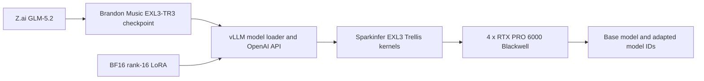

# Dynamic LoRA serving for GLM-5.2 EXL3 on four Blackwell GPUs

This repository is a reproducible way to run the 753-billion-parameter GLM-5.2 model, compressed
with EXL3, and switch a BF16 rank-16 LoRA adapter on and off without restarting the server.
It exposes the result through the familiar OpenAI-compatible API.

**Current release:** [Dynamic EXL3 LoRA runtime r2](https://github.com/jcartu/glm52-exl3-sparkinfer/releases/tag/exl3-lora-runtime-r2)  
**Container:** `ghcr.io/jcartu/glm52-exl3-lora@sha256:3014c71c1d216b8c9fb53326f3c6ffaa993a8145567c4a3513dc6c645ec60e5b`

> This is integration and serving work. It is not a new foundation model, it does not include
> GLM-5.2 weights, and it does not include a downloadable LoRA. The model, quantization format,
> inference engines, kernels, and supporting libraries come from the credited upstream teams.

## What this is

GLM-5.2 is too large for an ordinary workstation. Brandon Music's EXL3-TR3 checkpoint compresses
its routed experts and splits them across four 96 GB NVIDIA Blackwell workstation GPUs. This
project adds the missing piece needed to use a normal BF16 rank-16 LoRA with that compressed,
sharded model:

- LoRA corrections are applied to all supported attention projections.
- LoRA corrections are also applied inside the compressed routed experts: gate, up, and down.
- Each GPU loads only the adapter slice it owns; the full model is never reconstructed in RAM.
- The base model and adapter can be addressed as separate model IDs from the same server.
- The adapter can be loaded, unloaded, and reloaded through HTTP while the engine stays up.
- CUDA graphs, DCP4 prefix caching, and MTP-3 speculative decoding remain enabled.

In plain language: **keep the huge compressed model running, then attach or detach a much smaller
behavior adapter without reloading 332 GB of model weights.**



## Who this is for

This release is for:

- local-inference engineers working with very large MoE models;
- researchers testing LoRA behavior on a compressed GLM-5.2 deployment;
- teams with **four RTX PRO 6000 Blackwell 96 GB GPUs** and no NVLink;
- people who need a local OpenAI-compatible chat, completion, and tool-calling endpoint;
- maintainers who care about exact source commits, image digests, rollback, and repeatable tests.

This release is **not** a good fit for:

- a laptop, a single GPU, or GPUs with substantially less memory;
- generic Transformers loading—the checkpoint needs this custom vLLM/Sparkinfer path;
- training a LoRA;
- serving arbitrary LoRA ranks or several adapters at once;
- users who need the model's full one-million-token native window. The qualified cap here is
  32,768 tokens.

## The moving parts, without the jargon

| Term | What it means here |
|---|---|
| GLM-5.2 | The original open model created by the Z.ai / GLM-5 Team. |
| EXL3-TR3 | A low-bit representation of routed-expert weights, created with ExLlamaV3's Trellis format. |
| LoRA | A smaller set of corrections that changes model behavior without replacing the base weights. |
| Fully sharded | Every GPU stores and computes only its own part of the model and adapter. |
| TP4 | Four GPUs jointly hold the model. |
| DCP4 | The KV cache and decode context are distributed across those four GPUs. |
| MTP-3 | A draft head proposes up to three future tokens so accepted tokens can be produced faster. |
| CUDA graph | A recorded GPU execution plan that reduces launch overhead for repeated shapes. |
| Digest pin | An immutable container identity, unlike a tag that can be moved later. |

## What we changed

The work is split between two source repositories and this deployment repository:

1. **vLLM attention and loading**
   - Reads a PEFT LoRA manifest safely on each rank.
   - Loads rank-local BF16 factors for all supported GLM attention targets.
   - Applies the absorbed MLA `kv_b` correction in the correct projection space.
   - Preserves base requests when an adapter is registered.

2. **vLLM routed-expert bridge**
   - Recognizes EXL3 `RoutedExperts` as a real CUDA-backed layer.
   - Maps LoRA gate/up/down factors into the local expert and tensor-parallel domains.
   - Passes an adapter-aware execution plan to Sparkinfer.

3. **Sparkinfer staged Trellis execution**
   - Exposes preparation, first projection, activation, second projection, and reduction stages.
   - Keeps route ownership, expert numbering, aliases, scratch buffers, and CUDA graph state
     explicit rather than relying on hidden allocations.
   - Preserves exact no-adapter behavior.

4. **Release engineering**
   - Builds on a digest-pinned v31 base image.
   - Copies source from immutable Git tags instead of an untracked local overlay.
   - Records both source commits in OCI labels.
   - Ships tested Compose presets, dynamic load/unload commands, evidence, and rollback steps.

The detailed engineering and measurements are in
[`docs/RELEASE_TEST_SUITE.md`](docs/RELEASE_TEST_SUITE.md).

## What you need

- Linux with Docker Engine and Docker Compose v2;
- NVIDIA Container Toolkit;
- four RTX PRO 6000 Blackwell 96 GB GPUs;
- the [GLM-5.2 EXL3-TR3 checkpoint](https://huggingface.co/brandonmusic/GLM-5.2-EXL3-TR3-3.0bpw);
- a PEFT-compatible BF16 rank-16 LoRA directory containing `adapter_config.json` and one or more
  `.safetensors` files;
- enough local storage for the 332.19 GB checkpoint, container layers, and compilation cache.

The server binds to `127.0.0.1` by default. It is not exposed to the LAN or internet unless you
change `BIND_ADDRESS` yourself.

## Quick start

```bash
# 1. Download the model.
hf download brandonmusic/GLM-5.2-EXL3-TR3-3.0bpw \
  --local-dir "$HOME/models/GLM-5.2-EXL3-TR3-3.0bpw"

# 2. Point the release at the model, your own compatible adapter, and a persistent cache.
cd deploy
export MODEL_DIR="$HOME/models/GLM-5.2-EXL3-TR3-3.0bpw"
export ADAPTER_DIR="/path/to/your/rank16-adapter"
export CACHE_DIR="$HOME/.cache/glm52-exl3-lora-v31"

# 3. Start the digest-pinned base model server.
./server.sh start
./server.sh logs

# 4. After /health is ready, attach the adapter without restarting.
LORA_NAME=my-adapter ./server.sh load

# 5. Confirm that both model IDs are present.
./server.sh status
```

The default endpoint is `http://127.0.0.1:8000/v1`.

Base request:

```bash
curl http://127.0.0.1:8000/v1/chat/completions \
  -H 'Content-Type: application/json' \
  -d '{
    "model": "GLM-5.2-EXL3-TR3-3.0bpw",
    "messages": [{"role": "user", "content": "Explain prefix caching in one sentence."}],
    "temperature": 0,
    "max_tokens": 128
  }'
```

Adapter request:

```bash
curl http://127.0.0.1:8000/v1/chat/completions \
  -H 'Content-Type: application/json' \
  -d '{
    "model": "my-adapter",
    "messages": [{"role": "user", "content": "Explain prefix caching in one sentence."}],
    "temperature": 0,
    "max_tokens": 128
  }'
```

Unload it later:

```bash
LORA_NAME=my-adapter ./server.sh unload
```

## What was actually tested

All GPU results below were observed on four RTX PRO 6000 Blackwell 96 GB cards. They are release
gates, not estimates.

| Test | Result |
|---|---|
| vLLM focused LoRA tests | 109 passed |
| vLLM CPU MLA regressions | 22 passed |
| EXL3 bridge/device tests | 14 passed |
| Sparkinfer GPU tests | 29 passed |
| Dynamic adapter lifecycle | load, unload, and warm reload passed |
| Base isolation | base text and token log-probabilities stayed bit-for-bit equal across unload |
| Adapter activation | 32/32 compared token log-probabilities changed |
| CUDA graphs | base, adapter, and mixed batches passed |
| DCP4 prefix cache | repeated base prompt 11.57× faster; repeated adapter prompt 4.50× faster |
| MTP-3 | 1,599 of 1,839 proposed draft tokens accepted: 86.95% |
| Retrieval | 9/9 base and 9/9 adapter through 30,000-token prompts |
| API behavior | health, greedy chat, four tool scenarios, and streaming passed for both IDs |
| Near-capacity request | 30,553 adapted prompt tokens completed successfully |
| Deterministic quality checks | factual, arithmetic, Python expression, and exact formatting: 4/4 for both IDs |

Measured 128-token decode on the qualification workload:

| Mode | End-to-end rate |
|---|---:|
| Base model | 84.36 tokens/s |
| Adapter | 62.76 tokens/s |
| Mixed base + adapter, concurrency 2 | 97.83 aggregate tokens/s |

The adapter was slower than the base in this workload. This project does **not** claim that a
LoRA universally improves quality or speed; it claims that the adapter is applied correctly and
that the qualified serving paths remain operational.

## Reproducible release pins

| Artifact | Immutable identity |
|---|---|
| Runtime image | `ghcr.io/jcartu/glm52-exl3-lora@sha256:3014c71c1d216b8c9fb53326f3c6ffaa993a8145567c4a3513dc6c645ec60e5b` |
| Base image | `verdictai/glm52-exl3-sparkinfer@sha256:0433ae94665b769b78dd301f952d907508a3ba80bce47a1630ec20ade8812dff` |
| vLLM LoRA source | [`95d7914de1df93b39fe44957377311ddb752bd2f`](https://github.com/jcartu/vllm/commit/95d7914de1df93b39fe44957377311ddb752bd2f), tag `exl3-lora-experts-r1` |
| Sparkinfer LoRA source | [`fc8051efee755563e2c7a4ce87ce8b683db58381`](https://github.com/jcartu/sparkinfer/commit/fc8051efee755563e2c7a4ce87ce8b683db58381), tag `exl3-lora-trellis-r1` |
| Model checkpoint | [`brandonmusic/GLM-5.2-EXL3-TR3-3.0bpw`](https://huggingface.co/brandonmusic/GLM-5.2-EXL3-TR3-3.0bpw) |

Release r2 corrects the full vLLM provenance string recorded in r1 metadata. Both builds resolve
the same `95d7914` source tag and contain the same source revision; r2 is the authoritative image
because its full OCI label is accurate.

Build it yourself:

```bash
docker buildx build --load \
  --file build/Dockerfile \
  --build-context vllm-src=https://github.com/jcartu/vllm.git#exl3-lora-experts-r1 \
  --build-context sparkinfer-src=https://github.com/jcartu/sparkinfer.git#exl3-lora-trellis-r1 \
  --build-arg VLLM_COMMIT=95d7914de1df93b39fe44957377311ddb752bd2f \
  --build-arg SPARKINFER_COMMIT=fc8051efee755563e2c7a4ce87ce8b683db58381 \
  --tag glm52-exl3-lora:v31-lora-r2 .
```

## Qualified presets

| Setting | Default DCP4 release | DCP1 fallback |
|---|---:|---:|
| Tensor parallel size | 4 | 4 |
| Decode context parallel size | 4 | 1 |
| MTP | 3 greedy | disabled |
| GPU memory utilization | 0.93 | 0.90 |
| CUDA graph sizes | 4, 8 | 1, 2, 4, 8 |
| Max request length | 32,768 | 32,768 |
| Active sequences | 2 | 2 |
| Dynamic BF16 rank-16 LoRA | yes | yes |

Use `deploy/docker-compose.yml` unless you specifically need the conservative MTP-off DCP1
fallback.

## Known limits and warnings

- Only one BF16 rank-16 adapter is qualified at a time.
- LoRA ranks other than 16, 3D LoRA weights, and several simultaneous adapters were not tested.
- The release intentionally caps requests at 32,768 tokens and two active sequences.
- The base image logs a noisy FlashAttention-2 ABI probe error. The active backend is
  `B12X_MLA_SPARSE`; graph capture and serving continue successfully.
- First use of a new shape can trigger JIT compilation and a latency spike. Keep the cache mount.
- B12X PCIe all-reduce is stream-affine. Do not override
  `VLLM_DISABLE_SHARED_EXPERTS_STREAM=1` in the qualified graph preset.
- Asynchronous scheduling remains disabled.
- The qualification adapter is a local test artifact and is not redistributed here. Its local
  metadata did not contain creator or license information, so this project makes no ownership
  claim over it.

## Rollback

Every deployment is pinned by digest. To roll back, stop this release and start a previously
retained container or point `IMAGE` at a previous known-good digest:

```bash
cd deploy
./server.sh stop

IMAGE=ghcr.io/owner/image@sha256:PREVIOUS_DIGEST \
MODEL_DIR=/path/to/model \
ADAPTER_DIR=/path/to/adapter \
CACHE_DIR=/path/to/cache \
./server.sh start
```

The qualification machine also retains its pre-LoRA production container
`glm52-exl3-v26-5001` until the new release completes burn-in.

## Repository map

```text
build/Dockerfile                 reproducible image construction
deploy/docker-compose.yml        qualified TP4/DCP4/MTP-3 preset
deploy/docker-compose-dcp1.yml   qualified MTP-off fallback
deploy/server.sh                 start, stop, status, load, and unload commands
tests/                           API, tool-calling, streaming, and retrieval checks
docs/RELEASE_TEST_SUITE.md       detailed evidence and historical measurements
docs/independent-eval/           independently produced evaluation material
CREDITS.md                       people, projects, licenses, and contribution boundaries
```

## Credits and ownership

This work exists because many independent projects fit together. The short version:

- **Z.ai / the GLM-5 Team** created GLM-5.2.
- **Brandon Music** created and published the EXL3-TR3 checkpoint and the original serving stack,
  and authored the upstream EXL3 integration work.
- **malaiwah** contributed the rank-sliced MTP-78 head and independent evaluation work.
- **turboderp and ExLlamaV3 contributors** created the EXL3/Trellis format and kernels.
- **Luke Alonso and Sparkinfer contributors** created the Blackwell-focused kernel library.
- **the vLLM Team and contributors** created the serving engine and OpenAI-compatible API.
- **David Young** contributed the planned Trellis prefill work incorporated into the EXL3 path.
- **local-inference-lab, voipmonitor, and Verdict AI contributors** built and published the
  Blackwell runtime lineage used as the base.
- **Josh Cartu (`jcartu`)** integrated, repaired, qualified, documented, and published the dynamic
  LoRA release; the local implementation commits use the Git identity `Sisyphus`.
- **CodeRabbit, OpenAI Codex, and Anthropic Claude Code** assisted review, implementation, and
  documentation at different stages; humans selected the design and ran the reported hardware
  validation.

See **[CREDITS.md](CREDITS.md)** for the full layered attribution, contributor links, AI
assistance disclosure, and license boundaries. If someone is missing, please open an issue or PR;
attribution corrections are treated as release fixes.

## License

The scripts, configuration, tests, and documentation in this repository are MIT-licensed; see
[`LICENSE`](LICENSE). The container is an assembly of separately licensed components. GLM-5.2,
the quantized checkpoint, vLLM, Sparkinfer, ExLlamaV3, CUDA libraries, and every other dependency
remain under their own licenses. See [`CREDITS.md`](CREDITS.md) before redistributing the image or
model files.
